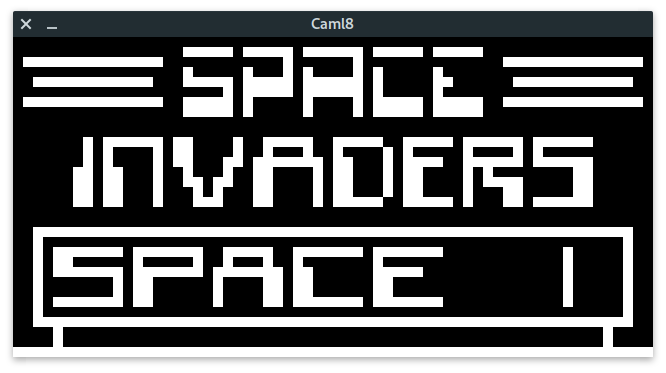
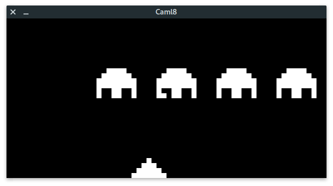
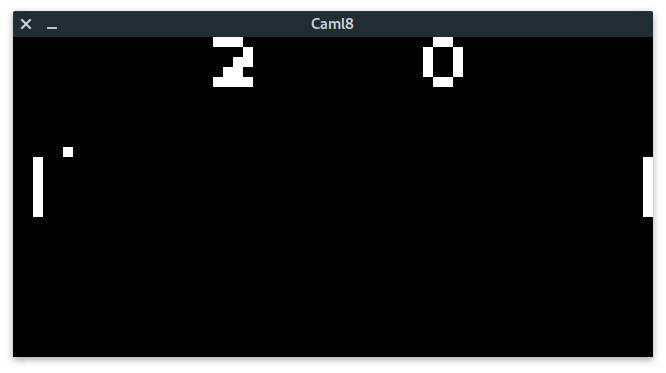

# caml8

A CHIP8 emulator written in OCaml

# Screen shots





# Dependencies

- [tsdl](https://github.com/dbuenzli/tsdl)
- [base](https://github.com/janestreet/base)
- [ppx_jane](https://github.com/janestreet/ppx_jane)

# How to run

## Play games

```shell
$ dune exec bin/caml8.exe -- resources/space_invadors.ch8
```

## Disassemble

```shell
$ dune exec bin/disassemble.exe -- resources/pong.ch8
```

## Run tests

```shell
$ dune test
```

## Todo

- Sound support
- Debugger
